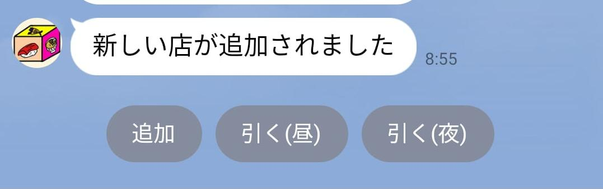
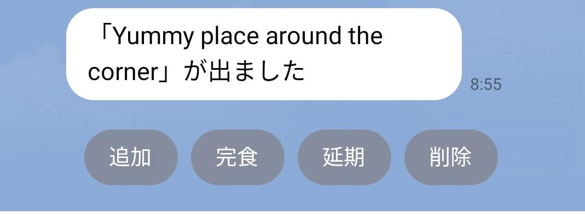

# Taberando

[Line](https://line.me) message application bot to randomly draw places/food to
eat lunch or dinner. Each discussion with the bot allow participants to add
places to eat. Every participant can also randomly draw a place from the already
registered places by all group participants.

This project was started to learn Rust and the code is therefore to be optimised
and improved. Besides, it surely has some security flaws (the data stored for
the author personal use is not confidential and can suffer from being
compromised)

## How to use:

Add the [Taberando](1656926700) bot as a friend on Line or invite the bot to a
group/chat room. Every discussion with the bot happens within the context of the
Line group/chat discussion and does not leak outside.

Communication with the bot happens in 2 steps:

**Editing/drawing step:** allows to either add entries (places to eat) to the
database or to draw a place to eat.

Actions:

- 追加:  Add a place
- 引く(昼): Draw a place for lunch
- 引く(夜): Draw a place for dinner

**Drawing step:** allow to retrieve an entry from the database

- 追加:  Add a place
- 完食: Went eating to the place
- 延期: Postpone the place for another time
- 削除: Delete the place from the data store

:warning: The bot can sometimes be out of sync (bug, issues) or not showing any
[Line quick reply buttons](https://developers.line.biz/en/docs/messaging-api/using-quick-reply)
. Sending the command `Refresh` to the discussion with the bot reset and
synchronize the bot status (no impact on the stored data).

### Data storage

The data is stored in
a [Firebase Realtime Database](https://firebase.google.com/docs/database/)

### Limitations

The project being hosted on a Heroku free tier plan, it can take some time for
the bot to reply.

### TODO

- [ ] **Add Unit Tests and run it in the CI**
- [ ] Fix Rust compiler warning
- [ ] Use more idiomatic Rust code + use static analysis
  tool ([Clippy?](https://github.com/rust-lang/rust-clippy))
- [ ] Improve multi-threading
- [ ] Allow for more flexibility on the data by adding a tag system
- [ ] Improve data structure and data storage to be more performant and avoid
  N+1 issues

### Environment Variables

| Key                 | Definition                                                                             |
|---------------------|----------------------------------------------------------------------------------------|
| LINE_CHANNEL_SECRET | To verify Line webhook fingerprint                                                     |
| LINE_TOKEN          | Line API OAuth token                                                                   |
| GOOGLE_CREDENTIALS  | Google Service account json as String [Firebase API] ; used for the Firebase datastore |

### Develop locally

The bot rely on a configured Line webhook url. In order to point the webhook to
a local port, the software `ngrok` is used. The bin `local_tunnel`
open a local port to the world under a generated url and update the Line webhook
configuration to use the generated url.  